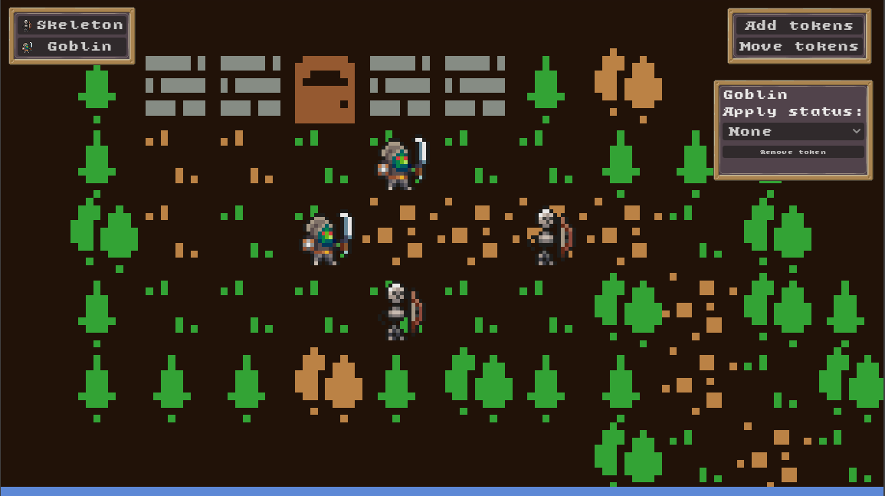

# 🐉 Combat tracker

A simple combat tracker + map making DnD tool made in Godot for folk who don't want to overcomplicate their prep, but still want to track the tokens as battle continues!

# 🏆 Attributions

Art assets:
- [Deep Dive Studio for their creature packs](https://deepdivegamestudio.itch.io/)
- [Fantasy Minimal Pixel Art GUI by eta](https://etahoshi.itch.io/minimal-fantasy-gui-by-eta)
- [Bountiful Bits](https://v3x3d.itch.io/bountiful-bits)

Scripts:
- [Panning Camera 2D](https://github.com/Julian-Vos/asset-library-MapCamera2D-4)
